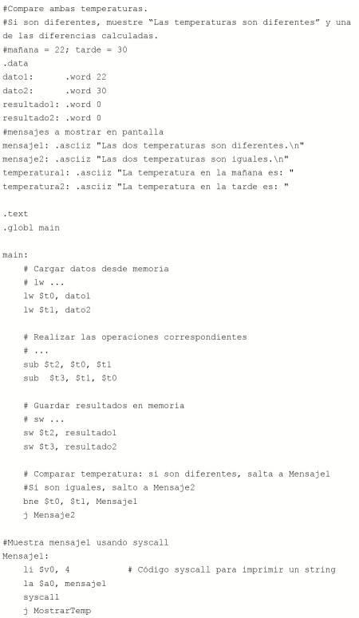
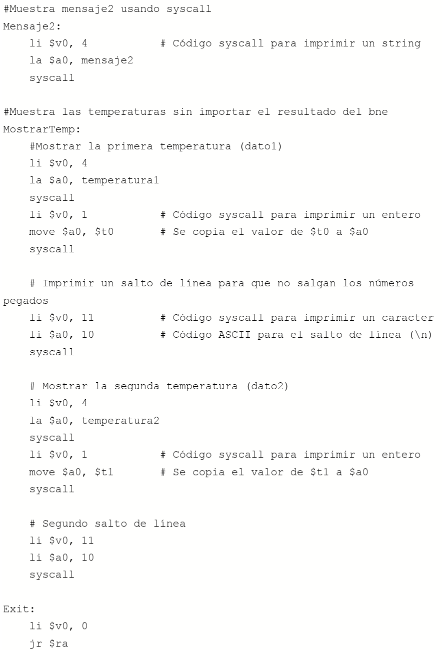
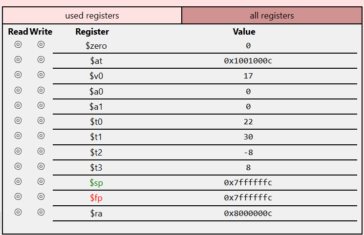
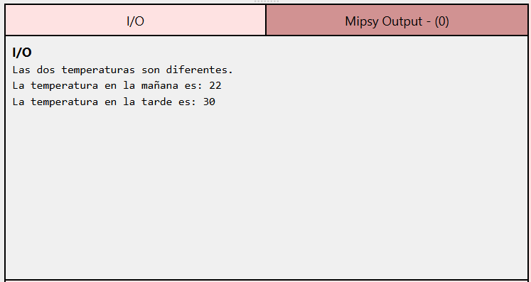

# MINIPROYECTO01

**Asignatura:** UCOM250 - ARQUITECTURA Y ORGANIZACIÓN DE COMPUTADORAS  
**Integrantes:** VALENTINA ANDRADE Y SASKIA BRITO  
**Año:** 2026  
**Fecha:** 04-10

---

## Descripción

### Escenario

**Escenario asignado al grupo**

El escenario es: Diferencia de temperaturas. La idea es registrar la temperatura en dos momentos diferentes del día, mostrar la diferencia entre los valores e indicar si verdaderamente cambió la temperatura.

### Resultado

Se deben comparar ambas temperaturas en dos momentos del día (mañana y tarde), y si son diferentes, se tendrá que mostrar el mensaje “Las temperaturas son diferentes” junto con las temperaturas en cuestión. Los valores de temperatura asignados se mantienen iguales, por lo que la condición de diferencia siempre se cumplirá con estos datos. Además, se muestra las diferencias entre las temperaturas (mañana-tarde y tarde-mañana).

---

## Análisis

### Datos del programa

| Dato | Valor inicial | Propósito |
|---|---:|---|
| dato1 ($t0)| 22: | valor a comparar con dato2 |
| dato2 ($t1) | 30: | valor a comparar con dato1 |
| resultado1 ($t2) | 0: | almacena la diferencia mañana-tarde |
| resultado2 ($t3) | 0: | almacena la diferencia tarde-mañana |
| mensaje1 | --- | indica que las temperaturas son diferentes |
| mensaje2 | --- | indica que las temperaturas son iguales |
| temperatura1 | --- | muestra el valor de dato1 (temperatura mañana) |
| temperatura2 | --- | muestra el valor de dato2 (temperatura tarde) |

### Operaciones requeridas

| Datos / Resultados | Propósito | Operación requerida | Instrucción MIPS |
|---|---|---|---|
| $t0, dato1 | Cargar dato desde memoria | Carga | `lw` |
| $t1, dato2 | Cargar dato desde memoria | Carga | `lw` |
| $t2, $t0, $t1 | Almacenar resultado de mañana-tarde | Resta | `sub` |
| $t3, $t1, $t0 | Almacenar resultado de tarde-mañana | Resta | `sub` |
| $t2, resultado1 | Guardar resultado1 en memoria | Almacenamiento | `sw` |
| $t3, resultado2 | Guardar resultado2 en memoria | Almacenamiento | `sw` |
| $t0, $t1, Mensaje1 | indicar a dónde saltar si los valores son diferentes | Salto | `bne` |
| Mensaje1 (syscall 4) | Mostrar si las temperaturas son iguales o diferentes | --- | `syscall` |
| MostrarTemp (syscall 1 y 4) | Mostrar las temperaturas | --- | `syscall` |

Dependiendo del escenario asignado, el programa utilizará algunas de las siguientes instrucciones:

- `lw`: cargar un dato desde memoria.
- `sw`: almacenar un resultado en memoria.
- `mul`: realizar una multiplicación.
- `sub`: realizar una resta.
- `div`: realizar una división.
- `rem`: obtener el residuo de una división.
- `seq`: determinar si dos valores son iguales.
- `sne`: determinar si dos valores son diferentes.
- `beq`: realizar un salto si dos valores son iguales.
- `bne`: realizar un salto si dos valores son diferentes.
- `syscall`: mostrar información por pantalla.

---

## Implementación

El código debe estar completo y funcional. Incluya comentarios que permitan identificar y comprender los principales bloques de la solución.

### Versión base

La carpeta `version_base/` contiene el programa proporcionado como punto de partida de la actividad.

**Archivo:**

```text
version_base/programa_base.s
```

Describa brevemente el estado inicial del programa:

El programa únicamente calcula las diferencias mañana-tarde y tarde-mañana. Los valores de las temperaturas están almacenadas en la memoria, no en registros. 

### Versión final

La carpeta `version_final/` contiene el programa desarrollado por el grupo.

**Archivo:**

```text
version_final/programa_final.s
```

La versión final debe incluir:

- Carga de los datos almacenados en memoria.
- Procesamiento mediante registros.
- Operaciones aritméticas o de comparación requeridas.
- Uso de `beq` o `bne` para controlar el flujo.
- Almacenamiento de los resultados en memoria.
- Presentación del resultado por pantalla.
- Comentarios explicativos dentro del código.

---

## Evidencias de ejecución

Incluya capturas de pantalla que permitan comprobar el desarrollo y funcionamiento del programa.

### Código







**Descripción:**  
En la captura #1, se muestra:
1) La declaración de los mensajes que se mostrarán en pantalla
2) La declaración de las variables con las temperaturas y las variables que almacenarán las restas
3) La carga de datos desde la memoria en registros
4) Las restas mañana-tarde y tarde mañana. Almacenamiento de los resultados en dos registros
5) Guardado de resultados en memoria
6) Comparación de las temperaturas y salto a Mensaje1 si se cumple la condición
7) Mensaje1: Código syscall para mostrar el mensaje correspondiente en pantalla

En la captura #2, se muestra:
1) Si no se cumple la condición, salto a Mensaje 2: se muestra el mensaje correspondiente
2) MostrarTemp: se muestran las dos temperaturas y saltos de líneas usando syscall

### Registros



**Descripción:**  
1) $t2: -8
Diferencia dato1-dato2

2) $t3: 8
Diferencia dato2-dato1

3) $t0: 22
dato1

4) $t1: 30
dato2

### Resultado



**Descripción:**  
Se muestran las dos temperaturas utilizadas (22 y 30). Además, se muestra el mensaje: "Las dos temperaturas son diferentes." porque las temperaturas son diferentes.

---

## Conclusiones

Presente las conclusiones relacionadas con la **experiencia desarrollada desde la perspectiva del aprendizaje**.

Puede considerar las siguientes preguntas:

- ¿Qué aprendieron durante el desarrollo del proyecto?
- ¿Qué parte de la actividad representó mayor dificultad?
- ¿Cómo resolvieron las dificultades encontradas?
- ¿Cómo contribuyó la implementación práctica a comprender el funcionamiento de un programa en lenguaje ensamblador?
- ¿Qué harían diferente si tuvieran que resolver nuevamente la actividad?

Aprendimos que hay más syscalls de las que pensábamos. Lo más complicado, de hecho, fue justamente buscar cómo imprimir cosas en pantalla. Buscamos en línea formas de hacerlo utilizando herramientas que ya conocíamos, lo que nos llevó a las syscalls. De ahí fue cuestión de buscar que número debíamos usar para la syscall. El implementar las syscalls nos permitió ver claramente la importancia del uso de registros para algo más que almacenar resultados de operaciones. De poder resolver nuevamente la actividad, buscaríamos utilizar nombres más descriptivos para las varibles.

> **Importante:** las conclusiones deben centrarse en la experiencia de aprendizaje y no limitarse a enumerar aspectos técnicos o instrucciones MIPS utilizadas.

---

## Documentación

El reporte completo del proyecto debe entregarse en formato PDF y almacenarse en:

```text
documentacion/reporte_proyecto.pdf
```

El documento debe contener las secciones establecidas en la plantilla del proyecto.

---

## Estructura del repositorio

```text
proyecto-mips/
│
├── README.md
│
├── version_base/
│   └── programa_base.s
│
├── version_final/
│   └── programa_final.s
│
├── evidencias/
│   ├── codigo.png
│   ├── registros.png
│   └── resultado.png
│
└── documentacion/
    └── reporte_proyecto.pdf
```

---

## Bibliografía

Registre las fuentes utilizadas para comprender las instrucciones MIPS, el funcionamiento del simulador y cualquier otro concepto empleado durante el desarrollo.

Las referencias deben presentarse utilizando **normas APA, séptima edición**.

### Ejemplos

#### Página web

```text
University of New South Wales. (n.d.). MIPS instruction set.
https://cgi.cse.unsw.edu.au/~cs1521/current/resources/mips-guide.html
```

#### Libro

```text
Patterson, D. A., & Hennessy, J. L. (2021). Computer organization 
and design: The hardware/software interface (6th ed.). Morgan Kaufmann.
```

#### Documentación de software

```text
MARS. (n.d.). MIPS Assembler and Runtime Simulator.
http://courses.missouristate.edu/kenvollmar/mars/
```

### Referencias utilizadas

1. Andrade, V., & Brito, S. (2026). Diferencia de temperaturas: Implementación en lenguaje ensamblador MIPS (Mini proyecto, Fase 1) [Trabajo académico no publicado]. Universidad de Especialidades Espíritu Santo.

2. mipsy. (s/f). Edu.au. Recuperado https://cgi.cse.unsw.edu.au/~cs1521/mipsy/ el 22 de septiembre de 2026, de 

3. West, Z. (2020, noviembre 27). MIPS Store Word (sw) vs. Load Word (lw). alpharithms. Αlphαrithms. https://www.alpharithms.com/mips-store-word-sw-vs-load-word-lw-475521/ 
